# Работа с уровнями изоляции транзакции в PostgreSQL

1) Запустить везде psql из под пользователя postgres
``` text
sudo -u postgres /usr/pgsql-15/bin/psql
```
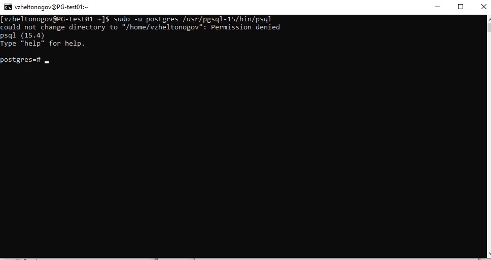

2) Выключить auto commit
``` sql   
\set AUTOCOMMIT off
```
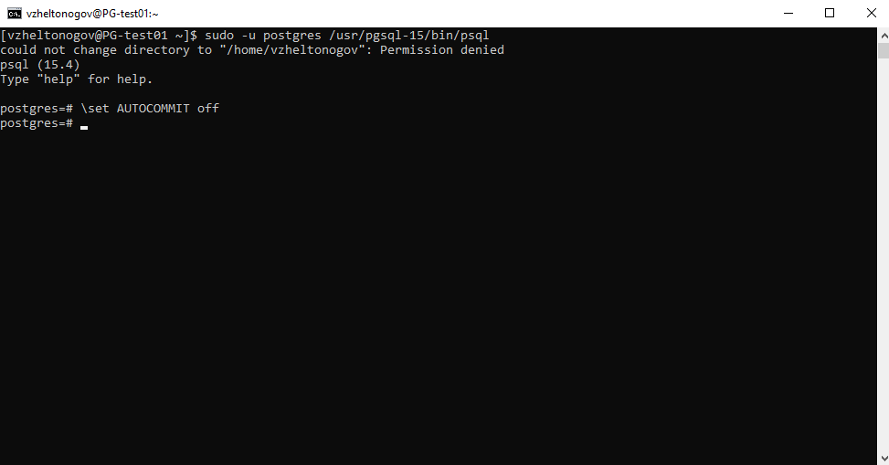

3) В первой сессии новую таблицу и наполнить ее данными:
 ``` sql    
 create table persons(id serial, first_name text, second_name text); 
 insert into persons(first_name, second_name) values('ivan', 'ivanov'); 
 insert into persons(first_name, second_name) values('petr', 'petrov'); 
 commit;
```
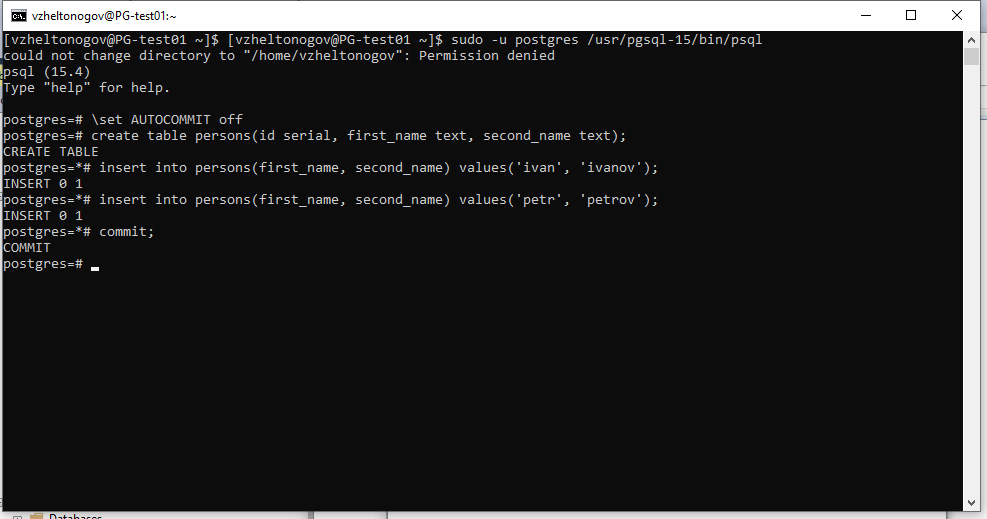


4) Посмотреть текущий уровень изоляции:
``` sql    
show transaction isolation level;
```
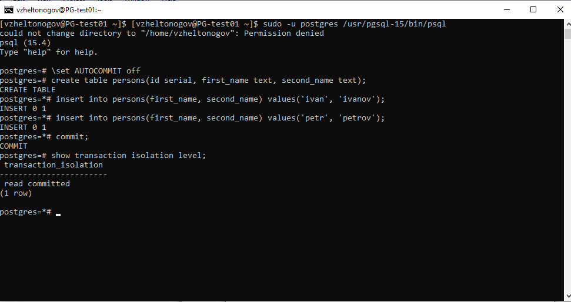


5) Начать новую транзакцию в обоих сессиях с дефолтным (не меняя) уровнем изоляции
   
   **первая сессия**
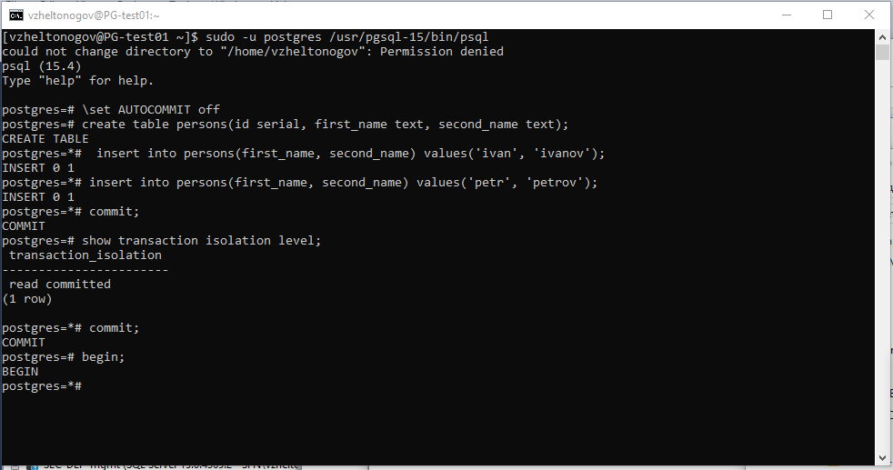

   **вторая сессия**
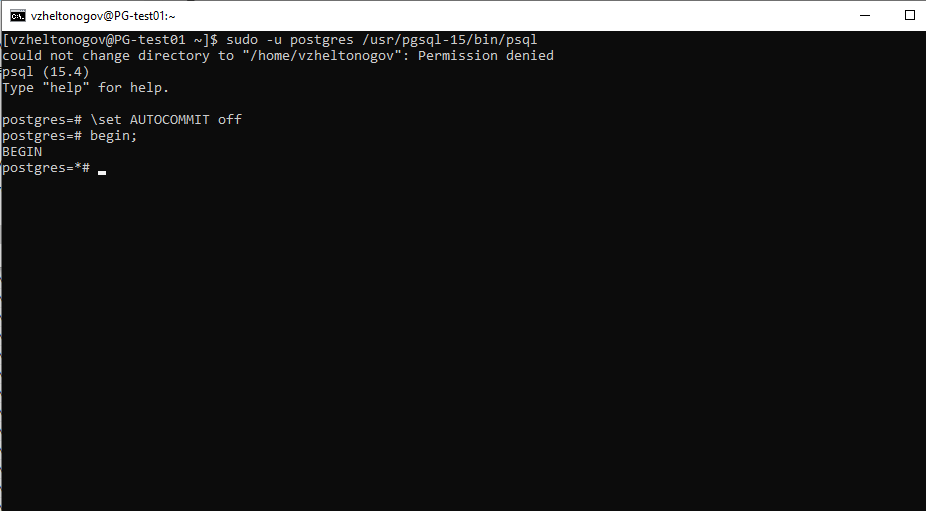

7) В первой сессии добавить новую запись
``` sql
insert into persons(first_name, second_name) values('sergey', 'sergeev');
```
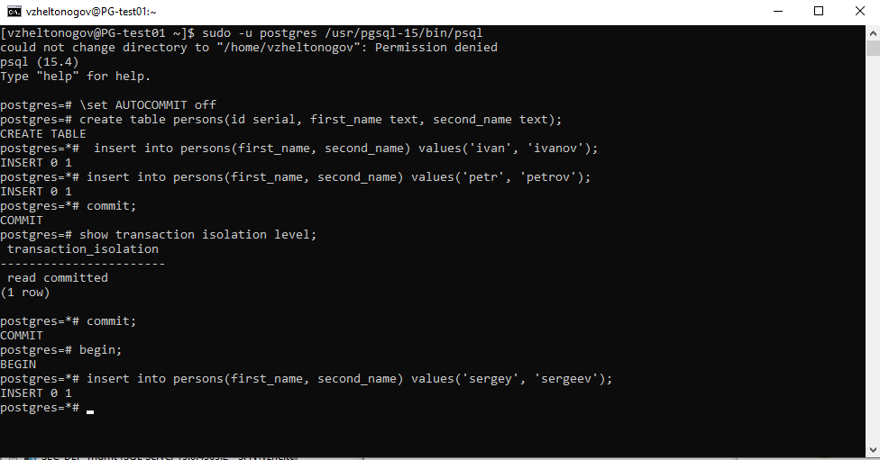

7) Сделать во второй сессии
``` sql
select * from persons;
```


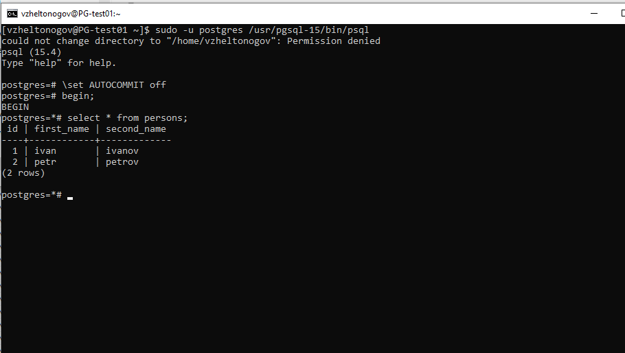

**Видите ли вы новую запись и если да то почему?**

**Нет, запись во второй сессии не видна, т.к. транзакция в первой не завершена, это из-за текущего уровня изоляции Read Commited.**

8) Завершить первую транзакцию
``` sql  
commit;
```
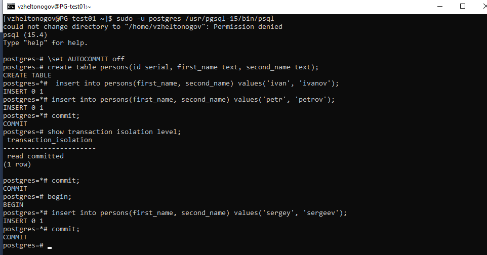

9) Сделать во второй сессии
``` sql  
select * from persons;
```

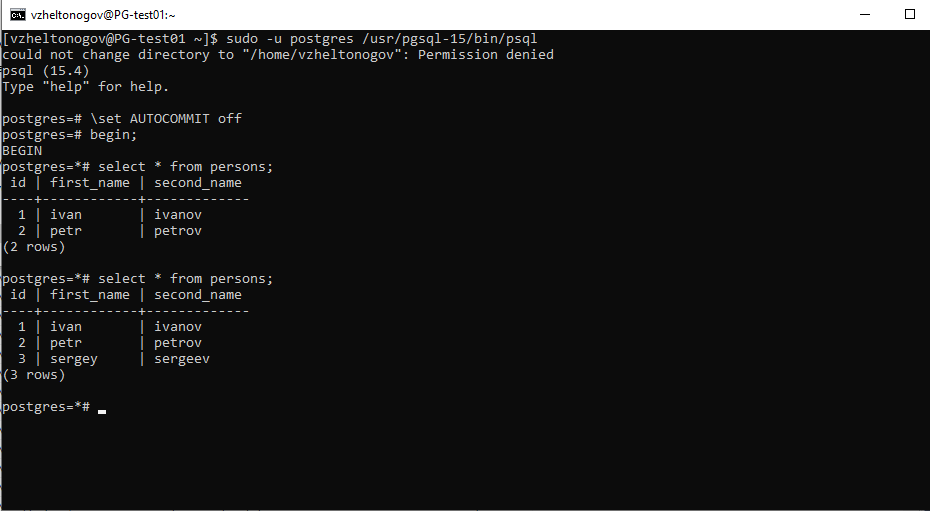


**Видите ли вы новую запись и если да то почему?**

**Теперь когда первая транзакция заверешена изменения видны во второй.**


10) Завершите транзакцию во второй сессии
``` sql  
commit;
```
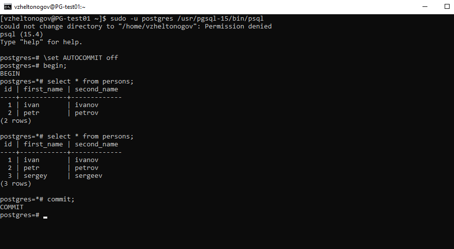

11) Начать новые но уже repeatable read транзации
``` sql     
\set AUTOCOMMIT off
set transaction isolation level repeatable read;
```
   **первая сессия**
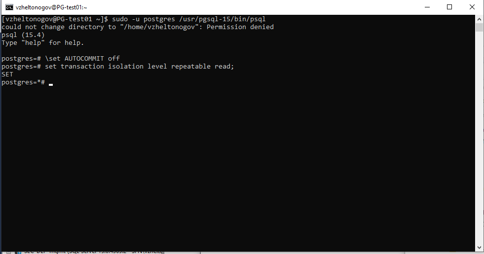
  
   **вторая сессия**
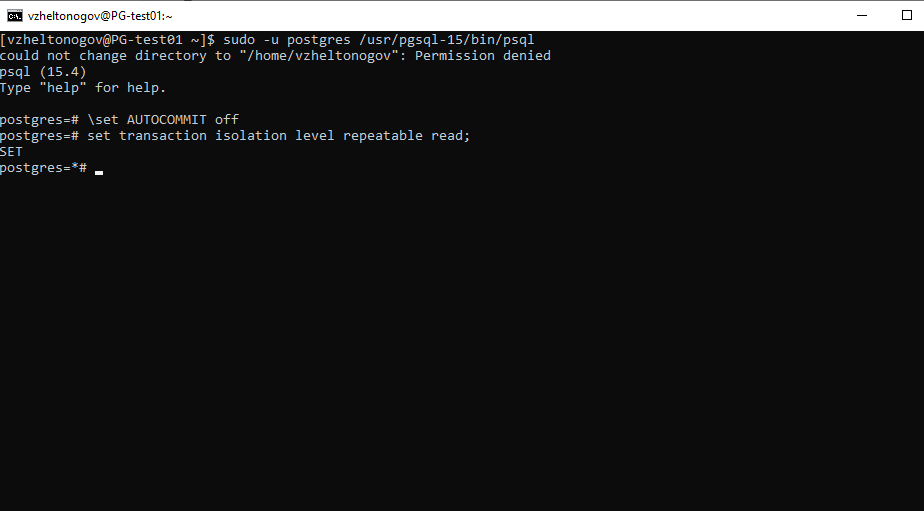


12) В первой сессии добавить новую запись
``` sql    
insert into persons(first_name, second_name) values('sveta', 'svetova');
```
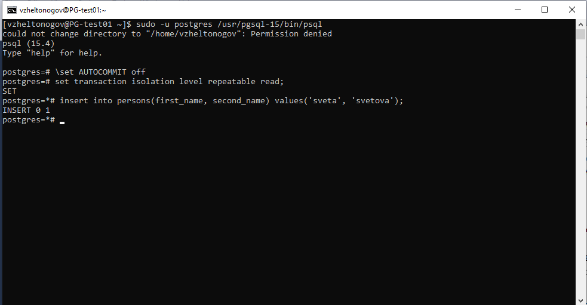

13) Сделать во второй сессии
``` sql   
select * from persons;
```
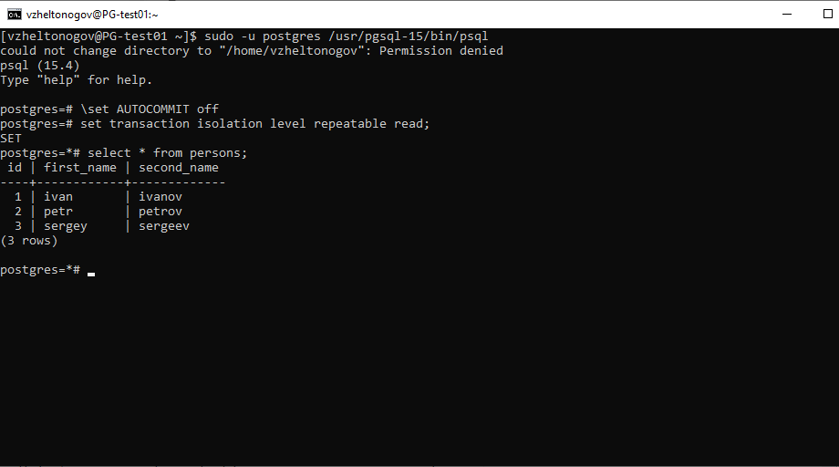

**Видите ли вы новую запись и если да то почему?**

**Нет**

14) Завершить первую транзакцию
``` sql 
commit;
```
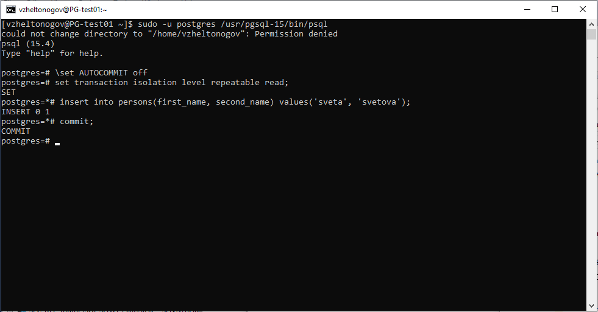

15) Сделать во второй сессии
``` sql
select * from persons;
```

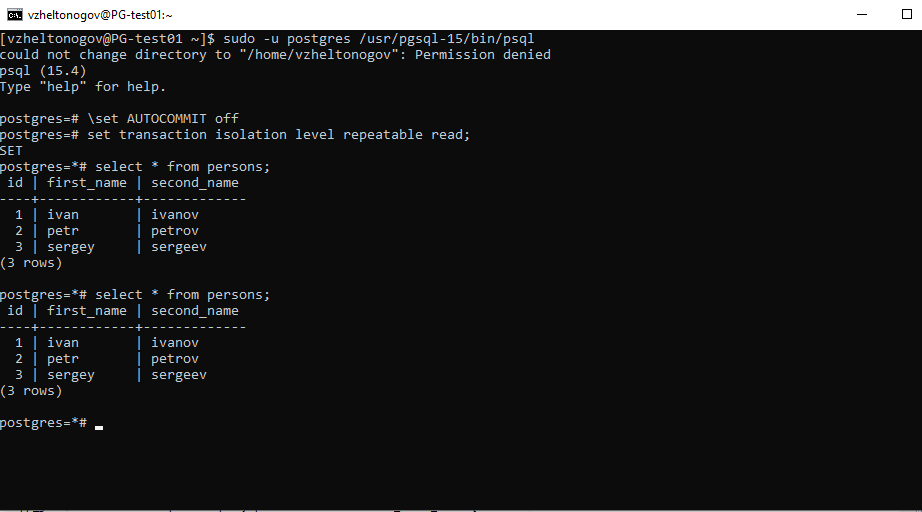

**Видите ли вы новую запись и если да то почему?**

**Нет, даже после завершения транзакции в первой сессии запись во второй не видна, это из-за уровня изоляции repeatable read**

16) Завершить вторую транзакцию
сделать во второй сессии
``` sql
select * from persons;
```
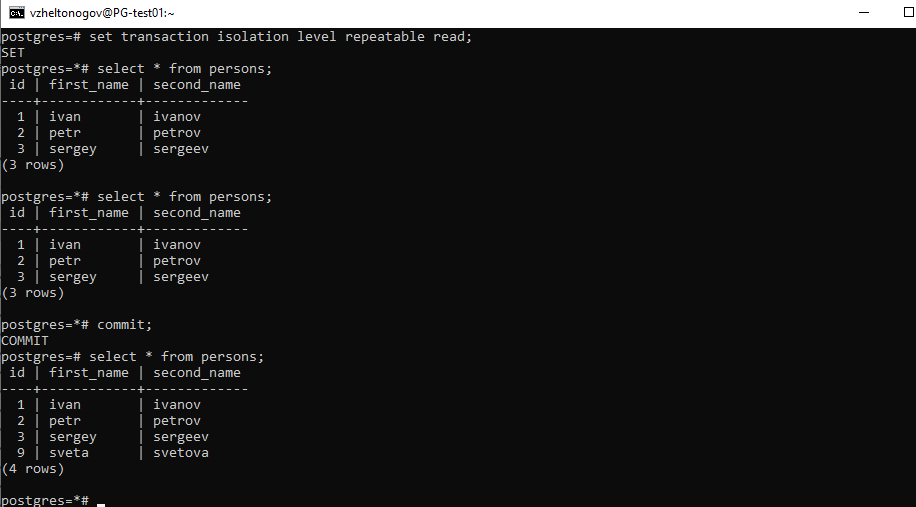

**Видите ли вы новую запись и если да то почему?**

**ДА, когда завершили транзакцию во второй сессии запись видна**
