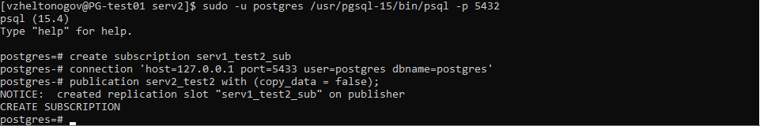

### Виды и устройство репликации в PostgreSQL. Практика применения.

Создаем отдельные кластера и настроим их, они будут отличаться портом.

``` text
Сервер №1 порт 5432
Сервер №2 порт 5433
Сервер №3 порт 5434
Сервер №4 порт 5435
```

``` text
sudo -u postgres /usr/pgsql-15/bin/pg_ctl -D /var/lib/pgsql/15/hw10_1 initdb
sudo -u postgres /usr/pgsql-15/bin/pg_ctl -D /var/lib/pgsql/15/hw10_2 initdb
sudo -u postgres /usr/pgsql-15/bin/pg_ctl -D /var/lib/pgsql/15/hw10_3 initdb

sudo -u postgres /usr/pgsql-15/bin/pg_ctl -D /var/lib/pgsql/15/hw10_1 -o "-p 5432" start
sudo -u postgres /usr/pgsql-15/bin/pg_ctl -D /var/lib/pgsql/15/hw10_2 -o "-p 5433" start
sudo -u postgres /usr/pgsql-15/bin/pg_ctl -D /var/lib/pgsql/15/hw10_3 -o "-p 5434" start
```


Меняем wal_level

Для сервера №1
``` text
sudo -u postgres /usr/pgsql-15/bin/psql -p 5432
alter system set wal_level = logical;
sudo -u postgres /usr/pgsql-15/bin/pg_ctl -D /var/lib/pgsql/15/hw10_1 -o "-p 5432" restart
```

Для сервера №2
``` text
sudo -u postgres /usr/pgsql-15/bin/psql -p 5433
alter system set wal_level = logical;
sudo -u postgres /usr/pgsql-15/bin/pg_ctl -D /var/lib/pgsql/15/hw10_1 -o "-p 5433" restart
```

Создаем таблицы на сервере №1


``` text
CREATE TABLE test1 (id serial PRIMARY KEY, data text);
CREATE TABLE test2 (id serial PRIMARY KEY, data text);
```

Создаем публикацию таблицы test1

``` text
create publication serv1_test1 for table test1;
```


Создаем таблицы на сервере №2

``` text
CREATE TABLE test1 (id serial PRIMARY KEY, data text);
CREATE TABLE test2 (id serial PRIMARY KEY, data text);
```

Создаем публикацию таблицы test2

``` text
create publication serv2_test2 for table test2;
```


И сразу же, находясь на втором сервере, подписываемся на первый сервер

``` text
create subscription serv2_test1_sub
connection 'host=127.0.0.1 port=5432 user=postgres dbname=postgres'
publication serv1_test1 with (copy_data = false);
```


На сервере №1 подписываемся на публикацию со 2-го

``` text
create subscription serv1_test2_sub
connection 'host=127.0.0.1 port=5433 user=postgres dbname=postgres'
publication serv2_test2 with (copy_data = false);
```


Проверяем подписки

Подключаемся к серверу №1 и вставляем данные

``` text
sudo -u postgres /usr/pgsql-15/bin/psql -p 5432
insert into test1(data) values ('serv1_value1');
insert into test1(data) values ('serv1_value2');
insert into test1(data) values ('serv1_value3');
```


Подключаемся к серверу №2 и вставляем данные

``` text
sudo -u postgres /usr/pgsql-15/bin/psql -p 5433
insert into test2(data) values ('serv2_value1');
insert into test2(data) values ('serv2_value2');
insert into test2(data) values ('serv2_value3');
```


Тут же, на сервере №2, проверяем подписку на table1

``` text
select * from test1;
```
Находясь на сервере №2 мы видим записи, которые вставлялись на сервере №1


Теперь подключаемся к серверу №1 и проверяем подписку

``` text
sudo -u postgres /usr/pgsql-15/bin/psql -p 5432
select * from test2;
```


Публикации и подписки работают на обоих серверах.


Настроим сервер №3, создадим подписку и установим copy_data = true и проверим таблицы.


``` text
sudo -u postgres /usr/pgsql-15/bin/psql -p 5434
alter system set wal_level = logical;
sudo -u postgres /usr/pgsql-15/bin/pg_ctl -D /var/lib/pgsql/15/hw10_3 -o "-p 5434" restart


CREATE TABLE test1 (id serial PRIMARY KEY, data text);
CREATE TABLE test2 (id serial PRIMARY KEY, data text);

create subscription serv3_test1_subs
connection 'host=127.0.0.1 port=5432 user=postgres dbname=postgres'
publication serv1_test1 with (copy_data = true);

create subscription serv3_test2_subs
connection 'host=127.0.0.1 port=5433 user=postgres dbname=postgres'
publication serv2_test2 with (copy_data = true);
```


Записи с сервера №1 и №2 появились на сервере №3.


Создаем бекап сервера №3 с помощью pg_basebackup с опцией -R

``` text
sudo -u postgres pg_basebackup -h localhost -p 5434 -W -D /var/lib/pgsql/15/backups -Ft -z -Xs -R --slot=replica --create-slot -P
```


И на осонове его создаем новый сервер №4

``` text
sudo -u postgres mkdir /var/lib/pgsql/15/hw10_4
sudo -u postgres tar xzf /var/lib/pgsql/15/backups/base.tar.gz -C /var/lib/pgsql/15/hw10_4
sudo -u postgres tar xzf /var/lib/pgsql/15/backups/pg_wal.tar.gz -C /var/lib/pgsql/15/hw10_4

sudo -u postgres chown -R postgres:postgres /var/lib/pgsql/15/hw10_4
sudo chmod 700 -R /var/lib/pgsql/15/hw10_4

sudo -u postgres /usr/pgsql-15/bin/pg_ctl -D /var/lib/pgsql/15/hw10_4 -o "-p 5435" start
```


Сервер №4 в статусе in recovery

``` text
sudo -u postgres /usr/pgsql-15/bin/psql -p 5435
SELECT pg_is_in_recovery();
```


Подключаемся к серверу №3, посмотрим на состояние репликации

``` text
sudo -u postgres /usr/pgsql-15/bin/psql -p 5434
SELECT * FROM pg_stat_replication \gx
```


Статус streaming
