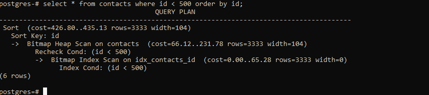
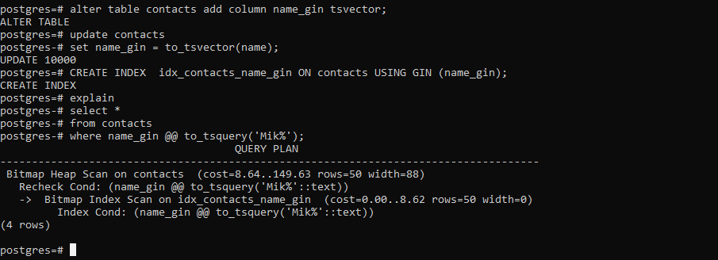
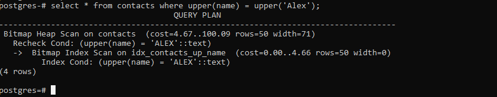
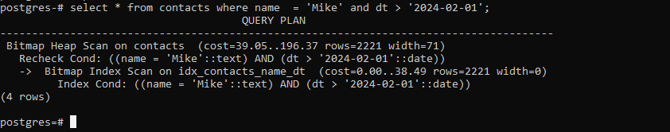
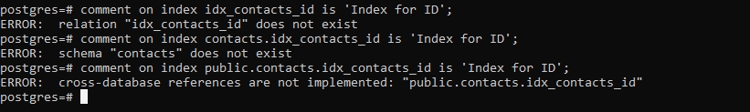

### Виды индексов. Работа с индексами и оптимизация запросов.

1. Создать индекс к какой-либо из таблиц вашей БД

``` text
create index idx_contacts_id on contacts(id);
```
	
2. Прислать текстом результат команды explain,в которой используется данный индекс

``` text
explain
select * from contacts where id < 500 order by id;
```



3. Реализовать индекс для полнотекстового поиска

``` text
alter table contacts add column name_gin tsvector;
update contacts
set name_gin = to_tsvector(name);

CREATE INDEX  idx_contacts_name_gin ON contacts USING GIN (name_gin);

explain
select *
from contacts
where name_gin @@ to_tsquery('Mik%');
```



4. Реализовать индекс на часть таблицы или индекс на поле с функцией

``` text
create index idx_contacts_up_name on contacts(upper(name));

explain
select * from contacts where upper(name) = upper('Alex');
```



5. Создать индекс на несколько полей

``` text   
create index idx_contacts_name_dt on contacts(name,dt);

explain
select * from contacts where name  = 'Mike' and dt > '2024-02-01';
``` 


6. Написать комментарии к каждому из индексов

``` text
comment on index idx_contacts_id is 'Index for ID';
comment on index contacts.idx_contacts_id is 'Index for ID';
comment on index public.contacts.idx_contacts_id is 'Index for ID';
```



Так и не понял как коментировать индекс.
