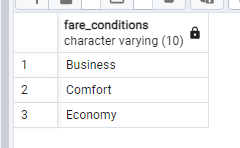
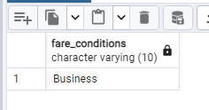

### Секционирование таблицы

Будем партиционировать таблицу ticket_flights по полю fare_conditions

``` text
select distinct fare_conditions from bookings.ticket_flights;
```


``` text
drop table if exists ticket_flights_part;
drop table if exists ticket_flights_default;
drop table if exists ticket_flights_business;
drop table if exists ticket_flights_comfort;
drop table if exists ticket_flights_economy;


create table ticket_flights_part (like bookings.ticket_flights)
PARTITION BY LIST(fare_conditions);

create table ticket_flights_business PARTITION OF ticket_flights_part FOR VALUES IN ('Business');
create table ticket_flights_comfort PARTITION OF ticket_flights_part FOR VALUES IN ('Comfort');
create table ticket_flights_economy PARTITION OF ticket_flights_part FOR VALUES IN ('Economy');

# так можно создать секцию для значений не попадающих значенией
create table ticket_flights_default PARTITION OF ticket_flights_part DEFAULT;

# заполняем таблицу данными
insert into ticket_flights_part select * from bookings.ticket_flights;
```

``` text
select distinct fare_conditions from ticket_flights_business;
```


``` text
select * from ticket_flights_comfort limit 10;
```


``` text
select distinct fare_conditions from ticket_flights_economy;
```


