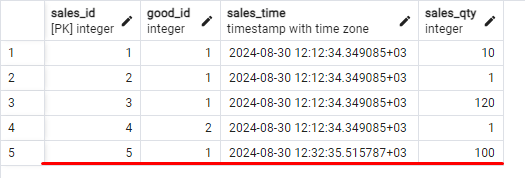
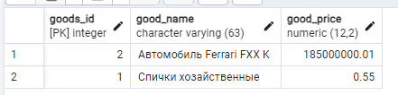
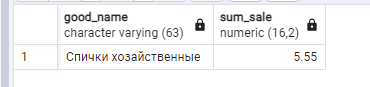

#### Хранимые функции и процедуры.

Создать триггер на таблице продаж, для поддержки данных в витрине в актуальном состоянии (вычисляющий при каждой продаже сумму и записывающий её в витрину)
Подсказка: не забыть, что кроме INSERT есть еще UPDATE и DELETE

Создаем таблицы и заполняем

``` sql
-- товары:
CREATE TABLE goods
(
    goods_id    integer PRIMARY KEY,
    good_name   varchar(63) NOT NULL,
    good_price  numeric(12, 2) NOT NULL CHECK (good_price > 0.0)
);
INSERT INTO goods (goods_id, good_name, good_price)
VALUES 	(1, 'Спички хозайственные', .50),
		(2, 'Автомобиль Ferrari FXX K', 185000000.01);

-- Продажи
CREATE TABLE sales
(
    sales_id    integer GENERATED ALWAYS AS IDENTITY PRIMARY KEY,
    good_id     integer REFERENCES goods (goods_id),
    sales_time  timestamp with time zone DEFAULT now(),
    sales_qty   integer CHECK (sales_qty > 0)
);

INSERT INTO sales (good_id, sales_qty) VALUES (1, 10), (1, 1), (1, 120), (2, 1);

-- с увеличением объёма данных отчет стал создаваться медленно
-- Принято решение денормализовать БД, создать таблицу
CREATE TABLE good_sum_mart
(
	good_name   varchar(63) NOT NULL,
	sum_sale	numeric(16, 2)NOT NULL
);

```

Также отключаем журналирование для таблицы-витрины для ускорения наполнения

``` sql
ALTER TABLE good_sum_mart SET UNLOGGED;
```


Запрос для отчета

``` sql
SELECT G.good_name, sum(G.good_price * S.sales_qty)
FROM goods G
INNER JOIN sales S ON S.good_id = G.goods_id
GROUP BY G.good_name;
```


Создаем функцию для заполнения витрины

``` sql
CREATE OR REPLACE FUNCTION report_func()
RETURNS trigger
AS
$$
BEGIN

truncate table good_sum_mart;
 
INSERT INTO good_sum_mart (good_name, sum_sale)
SELECT G.good_name, sum(G.good_price * S.sales_qty)
FROM goods G
INNER JOIN sales S ON S.good_id = G.goods_id
GROUP BY G.good_name;
RETURN NULL;
 
END;
$$
  LANGUAGE plpgsql
```

Создаем триггер

``` sql
CREATE TRIGGER tr_report
AFTER INSERT OR UPDATE OR DELETE
ON sales
FOR EACH STATEMENT
EXECUTE FUNCTION report_func();
```


Проверка

``` sql
INSERT INTO sales (good_id, sales_qty) VALUES (1, 100);

select * from sales;
```



``` sql
select * from good_sum_mart;
```


### Исправление замечаний

Как оказалось, чтобы работали объекты new в триггере нужно заменить FOR EACH STATEMENT на FOR EACH ROW

``` sql
CREATE OR REPLACE TRIGGER tr_report
AFTER INSERT OR UPDATE OR DELETE
ON sales
FOR EACH ROW
EXECUTE FUNCTION report_func();
```
Переписал ф-ию триггера. 
1) Теперь таблица good_sum_mart не пересчитывается полностью при срабатывании триггера.
2) Сохраняем предыдущие продажи по старым ценам (сами старые цены не храним)

``` sql
CREATE OR REPLACE FUNCTION report_func()
RETURNS trigger
AS
$$
BEGIN

with q as
(
 select g.good_name, g.good_price
 from goods g
 inner join sales s on s.good_id = g.goods_id
 where 	s.sales_id = new.sales_id
)
merge into good_sum_mart mart
using q on mart.good_name = q.good_name
when not matched then	   
	insert (good_name, sum_sale) values (q.good_name, q.good_price * new.sales_qty)
when matched then
-- сохраняем предыдущие продажи по старым ценам, добавляя к ним продажи по текущей цене
	update set sum_sale = mart.sum_sale + q.good_price * new.sales_qty;
	
	RETURN NULL;
END;
$$
  LANGUAGE plpgsql
  
```

Проверка

Добавляем 1-ю продажу

``` sql
INSERT INTO sales (good_id, sales_qty) VALUES (1, 10);
```


Проверяем таблицу-витрину


Добавляем 2-ю продажу

``` sql
INSERT INTO sales (good_id, sales_qty) VALUES (1, 1);
```


Проверяем таблицу-витрину



Добавляем 3-ю продажу

``` sql
INSERT INTO sales (good_id, sales_qty) VALUES (1, 2);
```


Проверяем таблицу-витрину


