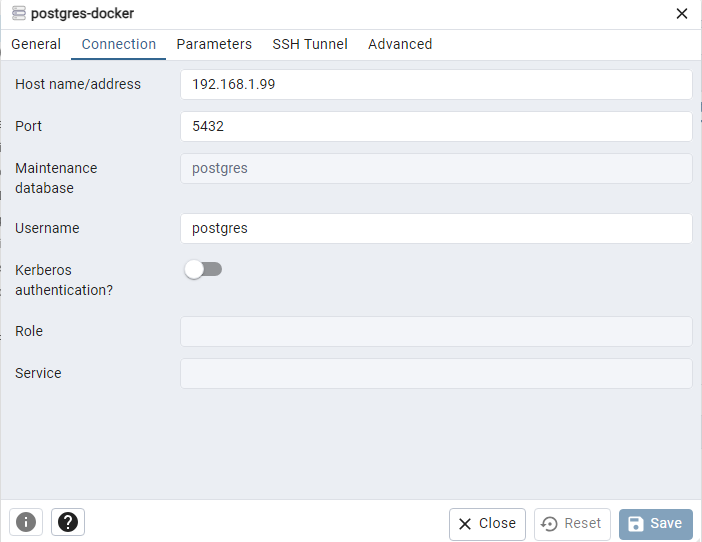

# Установка PostgreSQL 
1) Cоздать ВМ с Ubuntu 20.04/22.04 или развернуть докер любым удобным способом.
2) Поставить на нем Docker Engine
3) Сделать каталог /var/lib/postgres
``` text
sudo mkdir /var/lib/postgres
```


4) Развернуть контейнер с PostgreSQL 15 смонтировав в него /var/lib/postgresql

``` text
docker pull postgres:15
```


Создаем docker-сеть:
``` text
sudo docker network create pg-netw
```


Подключаем созданную сеть к контейнеру сервера Postgres и запускаем его:


5) Развернуть контейнер с клиентом postgres
Запускаем отдельный контейнер с клиентом в общей сети с БД:
``` text
sudo docker run -it --rm --network pg-netw --name pg-client postgres:15 psql -h pg-server -U postgres
```
 

6) Подключится из контейнера с клиентом к контейнеру с сервером и сделать таблицу с парой строк
``` text
CREATE DATABASE otus_test; 
create table test (t text);
insert into test(t) values ('one'),('two'),('three');
```


7. Подключится к контейнеру с сервером с ноутбука/компьютера извне инстансов GCP/ЯО/места установки докера

 Тут я долго мучался и не мог понять как пробросить порт из VM в хост. Поменял тип подключения на Bridge и база в контейнера pg-server стала доступна.
 Меняю св-во адаптера
 
 

Узнаю IP VM с Docker


В pgAdmin на хосте указываю адрес с VM Docker
 

 Select к ранее созданной таблице.
 
 
 
8. Удалить контейнер с сервером.
   Создать его заново.
   Подключится снова из контейнера с клиентом к контейнеру с сервером.
   Проверить, что данные остались на месте.

    
