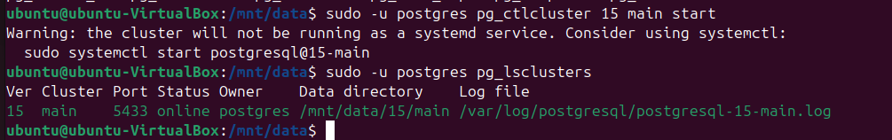

# Физический уровень PostgreSQL
1) Создайте виртуальную машину c Ubuntu 20.04/22.04 LTS в GCE/ЯО/Virtual Box/докере
2) Поставьте на нее PostgreSQL 15 через sudo apt
3) Проверьте что кластер запущен через
``` text
sudo -u postgres pg_lsclusters
```


4) зайдите из под пользователя postgres в psql и сделайте произвольную таблицу с произвольным содержимым
``` text
create table test(c1 text);
insert into test values('1');
\q
```

5) Остановите postgres например через sudo -u postgres pg_ctlcluster 15 main stop


6) создайте новый диск к ВМ
добавьте свеже-созданный диск к виртуальной машине - надо зайти в режим ее редактирования и дальше выбрать пункт attach existing disk
проинициализируйте диск согласно инструкции и подмонтировать файловую систему, только не забывайте менять имя диска на актуальное, 
в вашем случае это скорее всего будет /dev/sdb - https://www.digitalocean.com/community/tutorials/how-to-partition-and-format-storage-devices-in-linux
перезагрузите инстанс и убедитесь, что диск остается примонтированным (если не так смотрим в сторону fstab)


ссылка https://www.digitalocean.com/community/tutorials/how-to-partition-and-format-storage-devices-in-linux не открывается
поэтому сделал через gparted

Установка gparted


Выбираем нужный диск


Cоздаем раздел и форматируем в ext4


``` text
sudo lsblk --fs
sudo mkdir /mnt/data
```


Редактируем fstab


``` text
sudo mount -a
```

7) Cделайте пользователя postgres владельцем /mnt/data
``` text  
chown -R postgres:postgres /mnt/data/
```


8) Перенесите содержимое /var/lib/postgres/15 в /mnt/data

т.к мы перегружали VM после добавления диска - служба postgresql запущена, перед переносом ее нужно остановить


теперь переносим папку с данными

``` text  
mv /var/lib/postgresql/15 /mnt/data
```


9) Попытка запустить кластер

Ошибка, сервер использует старый путь, про новый ничего не знает


10) Задание: найти конфигурационный параметр в файлах раположенных в /etc/postgresql/15/main который надо поменять и поменяйте его
напишите что и почему поменяли

нужно отредактировать файл конфигурации postgresql /etc/postgresql/15/main/postgresql.conf


изменив параметр data_directory на новый путь


11) попытайтесь запустить кластер, напишите получилось или нет и почему
``` text  
sudo -u postgres pg_ctlcluster 15 main start
```



12) Зайдите через через psql и проверьте содержимое ранее созданной таблицы


