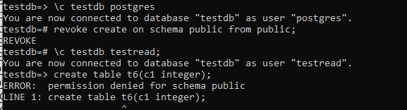

# Логический уровень

1) создайте новый кластер PostgresSQL 14
2) зайдите в созданный кластер под пользователем postgres
3) создайте новую базу данных testdb
``` text
create database testdb;
```
4) зайдите в созданную базу данных под пользователем postgres
``` text	
\c testdb
```
5) создайте новую схему testnm
``` text 
create schema testnm;
```
6) создайте новую таблицу t1 с одной колонкой c1 типа integer
``` text
create table t1(c1 integer);
```   
7) вставьте строку со значением c1=1
``` text    
insert into t1 values(1);
```
8) создайте новую роль readonly
``` text	
create role readonly;
```
9) дайте новой роли право на подключение к базе данных testdb
``` text 
grant connect on database testdb to readonly;
```
10) дайте новой роли право на использование схемы testnm
``` text    
grant usage on schema testnm to readonly;
```
11) дайте новой роли право на select для всех таблиц схемы testnm
``` text 
grant select on all tables in schema testnm to readonly;
```
12) создайте пользователя testread с паролем test123
``` text	
create user testread with password 'test123';
```
13) дайте роль readonly пользователю testread
``` text 
grant readonly to testread;
```


14) зайдите под пользователем testread в базу данных testdb
``` text 
\c testdb testread
```


15) сделайте select * from t1;


16) получилось?


    
    НЕТ
    
17) напишите что именно произошло в тексте домашнего задания    
    нет прав на select к таблице t1

18) у вас есть идеи почему? ведь права то дали?
19) посмотрите на список таблиц
20) подсказка в шпаргалке под пунктом 20


21) а почему так получилось с таблицей (если делали сами и без шпаргалки то может у вас все нормально)
    при создании таблицы явно не указывали схему, где создаем таблицу. (а в тексте задания не указано, что нужно создавать таблицу в этой схеме)


22) вернитесь в базу данных testdb под пользователем postgres
``` text 
\c testdb postgres
```


23) удалите таблицу t1

``` text
drop table t1;
```


24) создайте ее заново но уже с явным указанием имени схемы testnm
``` text
create table testnm.t1(c1 integer);
```


25) вставьте строку со значением c1=1

``` text
insert into testnm.t1 values(1);
```


26) зайдите под пользователем testread в базу данных testdb
27) сделайте select * from testnm.t1;
``` text
\c testdb testread
select * from testnm.t1;
```


28) получилось

    НЕТ
    
29) есть идеи почему? если нет - смотрите шпаргалку

таблица пересоздавалась, нужно заново дать права на SELECT

30) как сделать так чтобы такое больше не повторялось? если нет идей - смотрите шпаргалку

выдать права селект

``` text
\c testdb postgres 
grant SELECT on testnm.t1 TO readonly;
```
31) сделайте select * from testnm.t1;
    


32) получилось?
   ДА

33) есть идеи почему? если нет - смотрите шпаргалку

выдали точечно права на таблицу

34) сделайте select * from testnm.t1;
35) получилось?

ДА

36) ура!
	
37) теперь попробуйте выполнить команду

``` text 
create table t2(c1 integer); insert into t2 values (2);
```


38) а как так? нам же никто прав на создание таблиц и insert в них под ролью readonly?

видимо это стандартные пермишены

39) есть идеи как убрать эти права? если нет - смотрите шпаргалку

можно принудительно забрать права на создание и на вставку.

Делаем REVOKE, но права остались.
  


Переподключаемся к базе под пользователем postgres и под ним выполняем REVOKE


все равно есть права

Тогда гуглим и узнаем из документации (https://www.postgresql.org/docs/9.4/ddl-schemas.html#DDL-SCHEMAS-PRIV ) что нужно выполнить

``` text 
REVOKE CREATE ON SCHEMA public FROM PUBLIC;
```

 

Теперь прав на создание нет.
Осталось разобраться как запретить INSERT

``` text 
\c testdb postgres 
revoke insert on database testdb from testread;
\c testdb testread
 insert into t2 values (3);
```
но так нельзя

 

хорошо, теперь попробуем запретить для public, по аналогии с запретом CREATE

``` text 
\c testdb postgres 
revoke insert on database testdb from public;
\c testdb testread
 insert into t2 values (4);
```

 

но таких привелегий нет

тут стало совсем не понятно, поэтому воспользовался шпаргалкой

``` text
\c testdb postgres 
REVOKE ALL on DATABASE testdb FROM public; 
\c testdb testread
insert into t2 values (6);
```
но права остались

 

может что-то упустил, еще раз выполняю
 ``` text
\c testdb postgres
REVOKE CREATE ON SCHEMA public FROM PUBLIC; 
REVOKE ALL on DATABASE testdb FROM public; 
\c testdb testread
insert into t2 values (6);
```

 

но доступ на insert остался
