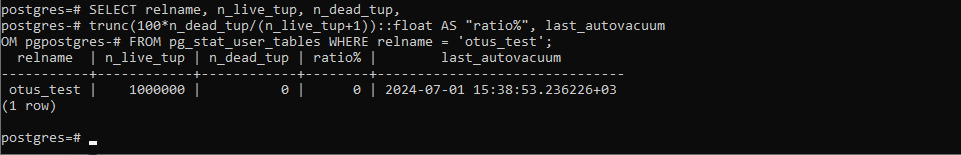

# MVCC, vacuum и autovacuum
1) Создать инстанс ВМ с 2 ядрами и 4 Гб ОЗУ и SSD 10GB
2) Установить на него PostgreSQL 15 с дефолтными настройками

``` text
sudo -u postgres /usr/pgsql-15/bin/pg_ctl -D /var/lib/pgsql/15/data initdb
sudo -u postgres /usr/pgsql-15/bin/pg_ctl -D /var/lib/pgsql/15/data start

```


3) Создать БД для тестов: выполнить pgbench -i postgres

``` text
 sudo -u postgres /usr/pgsql-15/bin/pgbench -i postgres
```


4) Запустить pgbench -c8 -P 6 -T 60 -U postgres postgres

``` text
sudo -u postgres /usr/pgsql-15/bin/pgbench -c8 -P 6 -T 60 -U postgres postgres
```


 
5) Применить параметры настройки PostgreSQL из прикрепленного к материалам занятия файла
	
``` text
sudo -u postgres nano /var/lib/pgsql/15/data/postgresql.conf
```

``` text	
max_connections = 40
shared_buffers = 1GB
effective_cache_size = 3GB
maintenance_work_mem = 512MB
checkpoint_completion_target = 0.9
wal_buffers = 16MB
default_statistics_target = 500
random_page_cost = 4
effective_io_concurrency = 2
work_mem = 6553kB
min_wal_size = 4GB
max_wal_size = 16GB
```


Делаем рестарт для применения настроек

``` text
sudo -u postgres /usr/pgsql-15/bin/pg_ctl -D /var/lib/pgsql/15/data restart
```


6) Протестировать заново

``` text
sudo -u postgres /usr/pgsql-15/bin/pgbench -c8 -P 6 -T 60 -U postgres postgres
```


7) Что изменилось и почему?

Ничего не заметил. А что tps должны были увеличиться?

8) Создать таблицу с текстовым полем и заполнить случайными или сгенерированными данным в размере 1млн строк

``` text
CREATE TABLE otus_test(txt char(100));
INSERT INTO otus_test(txt) SELECT 'sample txt' FROM generate_series(1,1000000);
```


9) Посмотреть размер файла с таблицей

``` text
SELECT pg_size_pretty(pg_total_relation_size('otus_test'));
```


10) 5 раз обновить все строчки и добавить к каждой строчке любой символ

```  text
DO
$do$
begin
for i in 1..5 LOOP
  RAISE NOTICE 'Iteration %', i;
  UPDATE otus_test SET txt = 'sample txt ' || to_char(i, 'FM099');
end loop;
end 
$do$;
```


11) Посмотреть количество мертвых строчек в таблице и когда последний раз приходил автовакуум

``` text
SELECT relname, n_live_tup, n_dead_tup,
trunc(100*n_dead_tup/(n_live_tup+1))::float AS "ratio%", last_autovacuum
FROM pg_stat_user_tables WHERE relname = 'otus_test';
```



12) Подождать некоторое время, проверяя, пришел ли автовакуум
Не дождался, запустил vacuum по таблице

``` text
VACUUM FULL otus_test;
```


13) 5 раз обновить все строчки и добавить к каждой строчке любой символ

``` text
DO
$do$
begin
for i in 1..5 LOOP
  RAISE NOTICE 'Iteration %', i;
  UPDATE otus_test SET txt = 'sample txt2 ' || to_char(i, 'FM099');
end loop;
end 
$do$;
```


14) Посмотреть размер файла с таблицей

``` text
SELECT pg_size_pretty(pg_total_relation_size('otus_test'));
```
Размер увеличился


15) Отключить Автовакуум на конкретной таблице

``` text
ALTER TABLE otus_test SET (autovacuum_enabled = off);
```


16) 10 раз обновить все строчки и добавить к каждой строчке любой символ

``` TEXT
DO
$do$
begin
for i in 1..10 LOOP
  RAISE NOTICE 'Iteration %', i;
  UPDATE otus_test SET txt = 'sample txt3 ' || to_char(i, 'FM099');
end loop;
end 
$do$;
```


17) Посмотреть размер файла с таблицей

``` text
SELECT pg_size_pretty(pg_total_relation_size('otus_test'));
```


19) Объясните полученный результат
Размер стал еще больше

20) Не забудьте включить автовакуум)

21) Задание со *:
Написать анонимную процедуру, в которой в цикле 10 раз обновятся все строчки в искомой таблице.
Не забыть вывести номер шага цикла.
