### Журналы

1. Настройте выполнение контрольной точки раз в 30 секунд.

``` text
sudo -u postgres nano /var/lib/pgsql/15/hw6/postgresql.conf
	
checkpoint_timeout = 30s
```
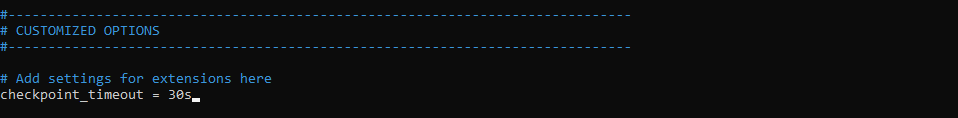

 Делаем рестарт
 
 ``` text
sudo -u postgres /usr/pgsql-15/bin/pg_ctl -D /var/lib/pgsql/15/hw6 restart
```

2. 10 минут c помощью утилиты pgbench подавайте нагрузку.

Инициализируем
``` text
sudo -u postgres /usr/pgsql-15/bin/pgbench -i -U postgres postgres
```
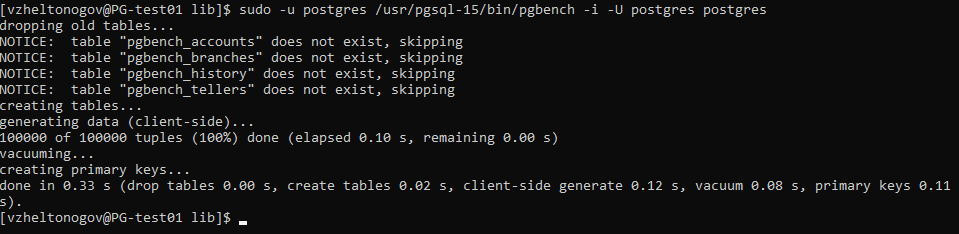

Запускаем 

sudo -u postgres /usr/pgsql-15/bin/pgbench -c8 -P 60 -T 600 -U postgres postgres

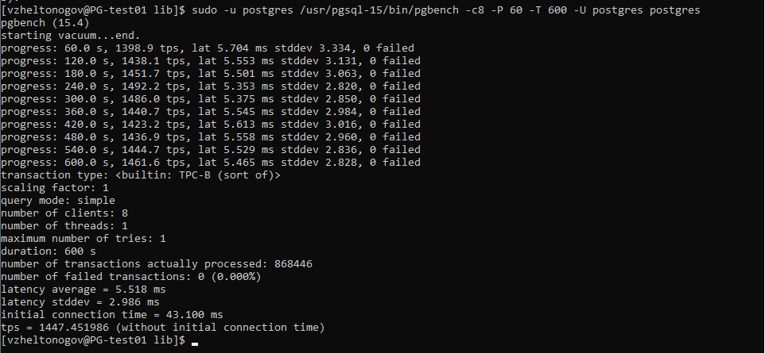

3. Измерьте, какой объем журнальных файлов был сгенерирован за это время. Оцените, какой объем приходится в среднем на одну контрольную точку.

``` text
sudo -u postgres ls -lh /var/lib/pgsql/15/hw6/pg_wal/
```
Было сгенерировано 6 файлов по 16mb = 96mb

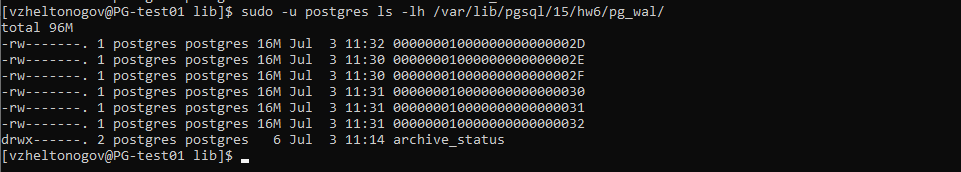

4. Проверьте данные статистики: все ли контрольные точки выполнялись точно по расписанию. Почему так произошло?

``` text
SELECT * FROM pg_stat_bgwriter \gx
```
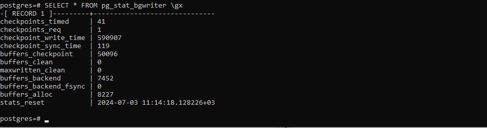

41 точка сгенерировалась по расписанию, 1 по требованию

5. Сравните tps в синхронном/асинхронном режиме утилитой pgbench. Объясните полученный результат.
   По умолчанию синхронный режим включен

   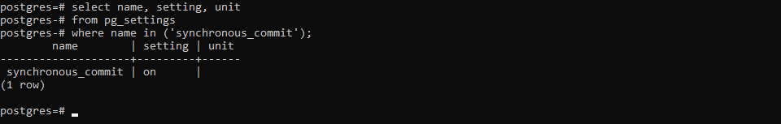

Запускаем pgbench

``` text
sudo -u postgres /usr/pgsql-15/bin/pgbench -c8 -P 10 -T 60 -U postgres postgres
```

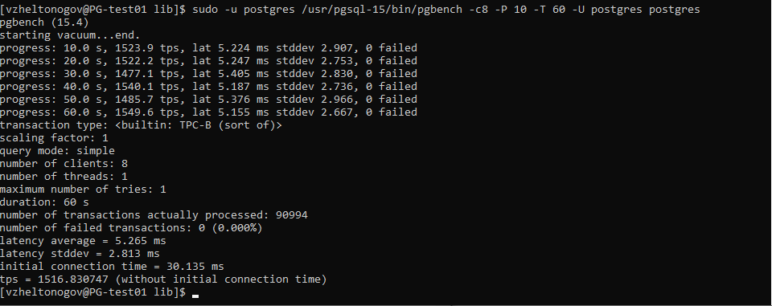

выключаем синхронный режим, перезапускаем сервер, запускаем pgbench

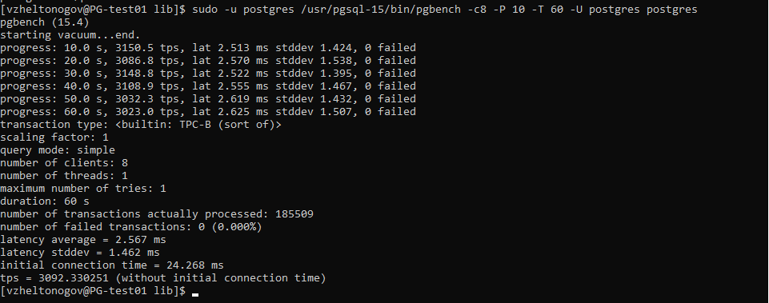


В асинхронном режиме из-за отсутствия журналирования уменьшилось latency и увеличилось tps.
   
6. Создайте новый кластер с включенной контрольной суммой страниц. Создайте таблицу. Вставьте несколько значений. 
Выключите кластер. Измените пару байт в таблице. Включите кластер и сделайте выборку из таблицы. Что и почему произошло? как проигнорировать ошибку и продолжить работу?

Останавливаем сервер

``` text
sudo -u postgres /usr/pgsql-15/bin/pg_ctl -D /var/lib/pgsql/15/hw6 stop
```

Включаем checksums

``` text
sudo -u postgres /usr/pgsql-15/bin/pg_checksums --enable -D /var/lib/pgsql/15/hw6
```

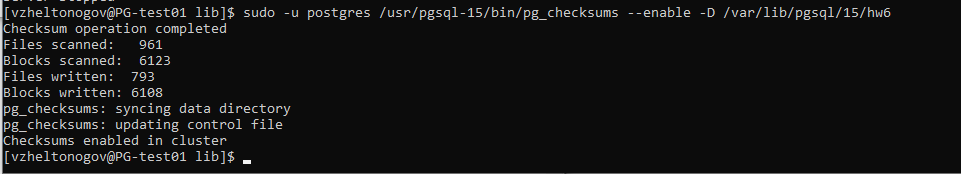

Включаем сервер.

Создаем и заполняем таблицу

``` text
create table t1(c1 integer);
insert into t1 values(1),(2),(3);
```

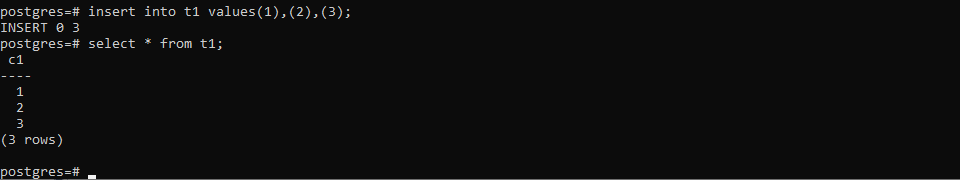

Узнаем где файл таблицы
``` text 
SELECT pg_relation_filepath('t1');
```

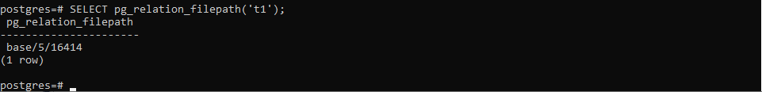

Остановим сервер, отредактируем файл, запустим сервер.

``` text
sudo -u postgres /usr/pgsql-15/bin/pg_ctl -D /var/lib/pgsql/15/hw6 stop
sudo -u postgres nano /var/lib/pgsql/15/hw6/base/5/16414
sudo -u postgres /usr/pgsql-15/bin/pg_ctl -D /var/lib/pgsql/15/hw6 start
```

Попробуем получить данные из таблицы

``` text
select * from t1;
```


Получаем ошибку crc


Чтобы игнорировать нужно установить ignore_checksum_failure = on.

``` text
set ignore_checksum_failure = on;
select * from t1;
```

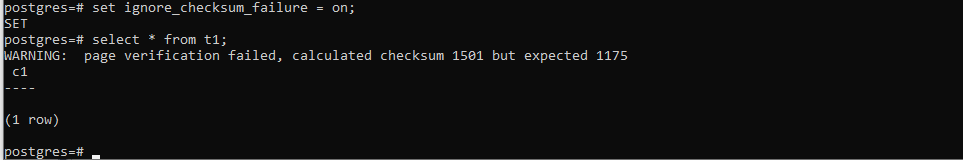
