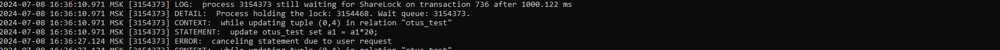
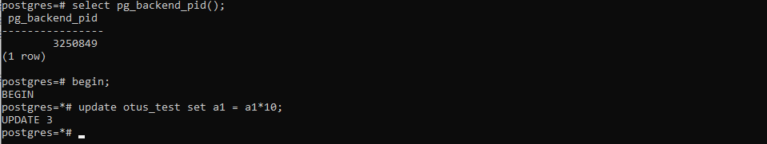
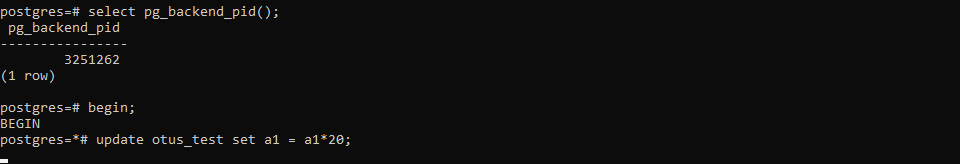
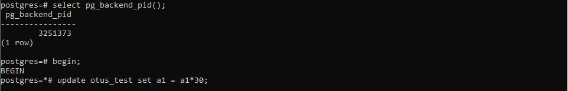

### Блокировки
1. Настройте сервер так, чтобы в журнал сообщений сбрасывалась информация о блокировках, удерживаемых более 200 миллисекунд. 
   Воспроизведите ситуацию, при которой в журнале появятся такие сообщения.

Добавляем в конфигурационный файл настройки

``` text
log_lock_waits = on
log_min_duration_statement = 200
```


Делаем рестарт сервера

``` text
show log_lock_waits;
show log_min_duration_statement;
```


``` text
create table otus_test(a1 integer);
insert into otus_test values(1),(2),(3);
```

В первой сессии

``` text
\set AUTOCOMMIT off
begin;
update otus_test set a1 = a1*10;
```


Во второй сессии

``` text
update otus_test set a1 = a1*20;
```
Ждем, затем прерываем ctrl+c


Смотрим лог

``` text
sudo -u postgres nano /var/lib/pgsql/15/hw7/log/postgresql-Mon.log
```



3. Смоделируйте ситуацию обновления одной и той же строки тремя командами UPDATE в разных сеансах. Изучите возникшие блокировки в представлении pg_locks и убедитесь, что все они понятны. Пришлите список блокировок и объясните, что значит каждая.

Запускаем update в трех сеансах.

Первый



Второй



Третий



Смотрим текущие блокировки

``` text
select pid, pg_blocking_pids(pid) AS wait_for, locktype, relation::regclass, mode from pg_locks order by pid;
```


1-ая транзакция (pid 3250849) наложила блокировку RowExclusiveLock на таблицу otus_test.
2-ая транзакция (pid 3251262) ждет 1-ю
3-я транзакция  (pid 3251373) ждет 2-ю
 
4. Воспроизведите взаимоблокировку трех транзакций. Можно ли разобраться в ситуации постфактум, изучая журнал сообщений?
   
5. Могут ли две транзакции, выполняющие единственную команду UPDATE одной и той же таблицы (без where), заблокировать друг друга?

