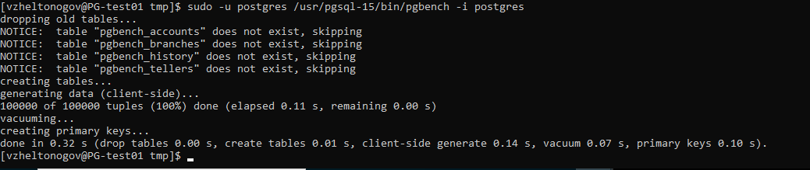
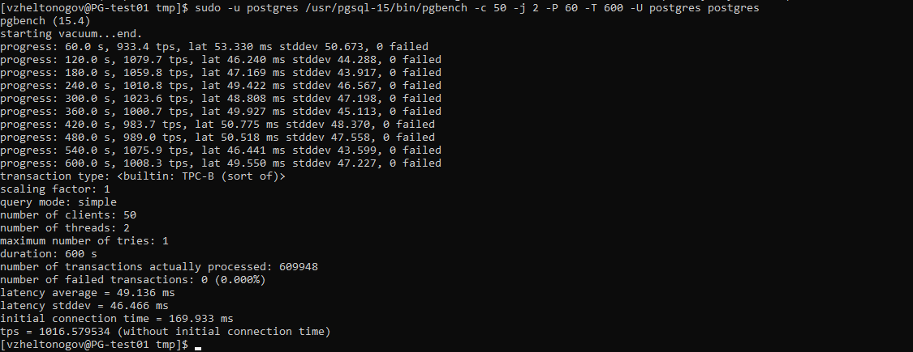
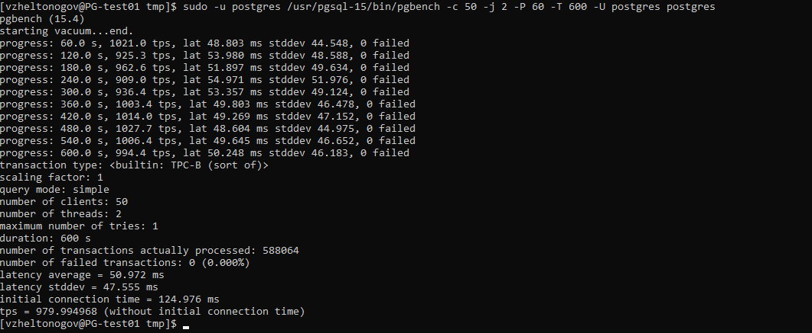
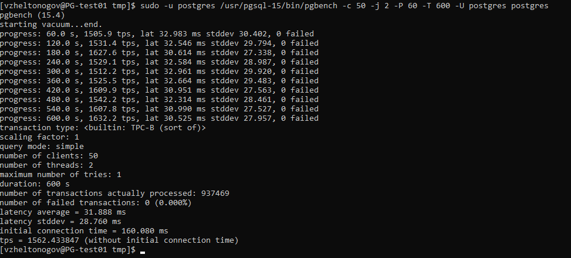

### Настройка PostgreSQL

1) развернуть виртуальную машину любым удобным способом
поставить на неё PostgreSQL 15 любым способом

Проинициализируем новый кластер
``` text
sudo -u postgres /usr/pgsql-15/bin/pg_ctl -D /var/lib/pgsql/15/hw8 initdb
sudo -u postgres /usr/pgsql-15/bin/pg_ctl -D /var/lib/pgsql/15/hw8 start
```

Проинициализируем таблицы для pgbench

``` text
sudo -u postgres /usr/pgsql-15/bin/pgbench -i postgres
```




Выполним эталонный замер производительности

``` text
sudo -u postgres /usr/pgsql-15/bin/pgbench -c 50 -j 2 -P 60 -T 600 -U postgres postgres
```



2) настроить кластер PostgreSQL 15 на максимальную производительность не обращая внимание на возможные проблемы 
с надежностью в случае аварийной перезагрузки виртуальной машины
нагрузить кластер через утилиту через утилиту pgbench (https://postgrespro.ru/docs/postgrespro/14/pgbench)

Применим конфиг с сайта

``` text
# DB Version: 15
# OS Type: linux
# DB Type: web
# Total Memory (RAM): 4 GB
# CPUs num: 2
# Data Storage: ssd

max_connections = 200
shared_buffers = 1GB
effective_cache_size = 3GB
maintenance_work_mem = 256MB
checkpoint_completion_target = 0.9
wal_buffers = 16MB
default_statistics_target = 100
random_page_cost = 1.1
effective_io_concurrency = 200
work_mem = 2621kB
huge_pages = off
min_wal_size = 1GB
max_wal_size = 4GB
```

Сделаем замеры



TPS осталось на том же уровне


Отключим параметры, которые могут повлиять на производительность.

``` text
synchronous_commit = off
fsync = off
full_page_writes = off
```

Сделаем замеры



Наблюдаем увеличение tps.
