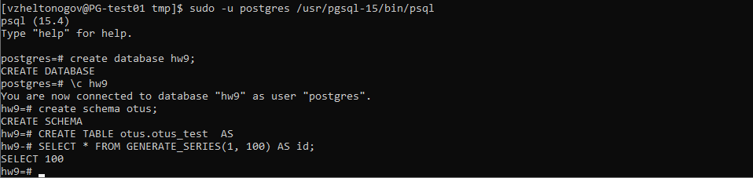
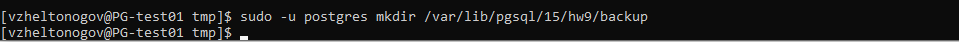
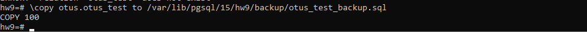
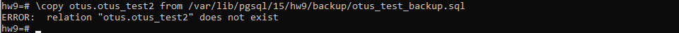
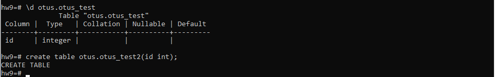
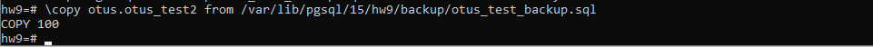
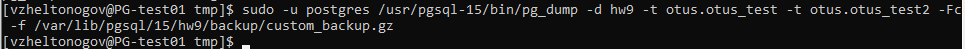
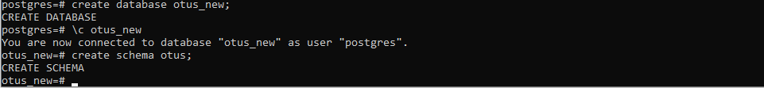
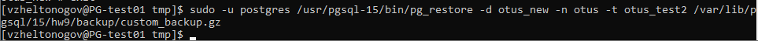
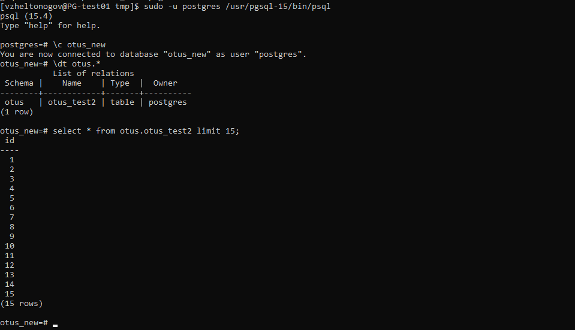

### Резервное копирование и восстановление 
1. Создаем ВМ/докер c ПГ.

``` text
sudo -u postgres /usr/pgsql-15/bin/pg_ctl -D /var/lib/pgsql/15/hw9 initdb
sudo -u postgres /usr/pgsql-15/bin/pg_ctl -D /var/lib/pgsql/15/hw9 start
sudo -u postgres /usr/pgsql-15/bin/psql
```

2. Создаем БД, схему и в ней таблицу.

``` text
create database hw9;
\c hw9
create schema otus;
```

3. Заполним таблицы автосгенерированными 100 записями.

``` text
CREATE TABLE otus.otus_test  AS 
SELECT * FROM GENERATE_SERIES(1, 100) AS id;
```



4. Под линукс пользователем Postgres создадим каталог для бэкапов

``` text
sudo -u postgres mkdir /var/lib/pgsql/15/hw9/backup
```



5. Сделаем логический бэкап используя утилиту COPY

``` text
\copy otus.otus_test to /var/lib/pgsql/15/hw9/backup/otus_test_backup.sql
```



6. Восстановим в 2 таблицу данные из бэкапа.

``` text
\copy otus.otus_test2 from /var/lib/pgsql/15/hw9/backup/otus_test_backup.sql
```


Просто так не восстановить таблицу из бекапа, нужно заранее создать таблицу.

Узнаем структуру старой таблицы и создаем новую.

``` text
\d otus.otus_test
create table otus.otus_test2(id int);
```



Восстанавливаем из бекапа

``` text
\copy otus.otus_test2 from /var/lib/pgsql/15/hw9/backup/otus_test_backup.sql
```


Таблица восстановлена

7. Используя утилиту pg_dump создадим бэкап в кастомном сжатом формате двух таблиц.
   Указываем новую базу и полный путь к таблицам

``` text   
sudo -u postgres /usr/pgsql-15/bin/pg_dump -d hw9 -t otus.otus_test -t otus.otus_test2 -Fc -f /var/lib/pgsql/15/hw9/backup/custom_backup.gz
```


8. Используя утилиту pg_restore восстановим в новую БД только вторую таблицу!

Создаем новую базу со схемой
``` text
create database otus_new;
create schema otus;
```




Восстанавливаем вторую таблицу в новую базу

``` text
sudo -u postgres /usr/pgsql-15/bin/pg_restore -d otus_new -n otus -t otus_test2 /var/lib/pgsql/15/hw9/backup/custom_backup.gz 
```



Проверяем что таблица появилась в новой базе


